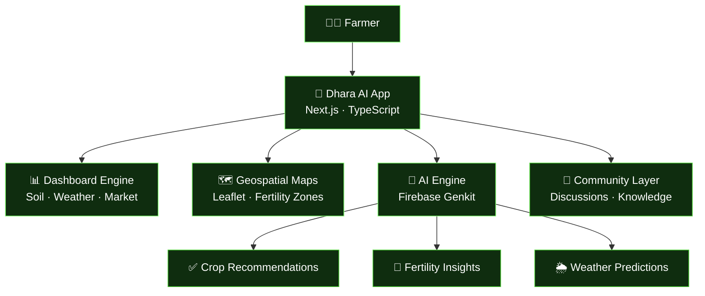

<div align="center">


<br/>

<p align="center">
  
</p>

<br/>

<p align="center">
  
  &nbsp;
  
  &nbsp;
  
  &nbsp;
  
</p>

<p align="center">
  
  
  
  
  
</p>

</div>

---

## What is Dhara AI?

Dhara AI is not just a dashboard. It is a **decision engine for agriculture**.

Farming decisions — what to plant, when to irrigate, where fertility is weak, what prices to expect — have always depended on experience and intuition. Dhara AI turns that process into data-driven precision, localized for Indian soil types, Indian weather patterns, and Indian languages.

From a smallholder in Odisha to an agronomist managing thousands of acres — Dhara AI makes precision farming **accessible, explainable, and actionable**.

```
Sensor Data ──┐
Weather API ──┤──▶  AI Engine  ──▶  Decision Layer  ──▶  Farmer Dashboard
Soil Reports ─┘    (Genkit AI)     (Recommendations)     (Next.js + Maps)
```

---

## Core Features

<table>
<tr>
<td width="50%">

### 🧠 AI-Powered Intelligence
- Smart **crop recommendations** based on soil + climate
- Soil fertility inference from NPK readings
- Explainable AI — farmers see *why*, not just *what*
- Seasonal trend analysis
- Powered by **Firebase Genkit**

</td>
<td width="50%">

### 🌍 Multilingual by Design
- 🇬🇧 English
- 🇮🇳 Hindi
- 🇧🇩 Bengali
- 🟠 Odia

Built for the field, not just the boardroom. Insights delivered in the farmer's own language.

</td>
</tr>
<tr>
<td width="50%">

### 📊 Real-Time Dashboard
- Live **soil moisture** tracking
- NPK level visualization
- Hyperlocal weather insights
- Live **market price** monitoring
- Alerts & threshold notifications

</td>
<td width="50%">

### 🗺️ Smart Farm Mapping
- Interactive land mapping via **Leaflet**
- AI-generated fertility zone overlays
- Location-aware, plot-level insights
- Field boundary drawing & management
- Crop rotation history per plot

</td>
</tr>
</table>

<table>
<tr>
<td width="100%">

### 🤝 Community Layer
- Farmer-to-farmer discussion forums
- Knowledge sharing across regions
- Local crop insight boards
- Agronomist Q&A threads

</td>
</tr>
</table>

---

## System Architecture



---

## Tech Stack

| Layer | Technology | Purpose |
|-------|-----------|---------|
| **Frontend** | Next.js 14 · TypeScript · Tailwind CSS | App shell, routing, UI |
| **AI / Inference** | Firebase Genkit · Gemini | Crop & fertility intelligence |
| **Maps** | Leaflet.js | Interactive farm mapping & overlays |
| **i18n** | next-intl / custom locales | English, Hindi, Bengali, Odia support |
| **State** | React Context API | Global farm & user state |
| **Backend / DB** | Firebase | Auth, Firestore, real-time sync |

---

## Project Structure

```
dhara_ai.web/
│
├── 📁 src/
│   ├── 📁 ai/                    # Firebase Genkit flows & prompts
│   │   ├── flows/                # Crop recommendation, soil analysis
│   │   └── genkit.ts             # AI client setup
│   │
│   ├── 📁 app/                   # Next.js App Router pages
│   │   ├── dashboard/            # Main dashboard
│   │   ├── map/                  # Farm mapping view
│   │   ├── community/            # Farmer forums
│   │   └── layout.tsx
│   │
│   ├── 📁 components/            # UI components
│   │   ├── charts/               # NPK, moisture, market visuals
│   │   ├── map/                  # Leaflet wrappers & overlays
│   │   └── ai/                   # Recommendation cards
│   │
│   ├── 📁 locales/               # Translation files
│   │   ├── en.json
│   │   ├── hi.json
│   │   ├── bn.json
│   │   └── or.json
│   │
│   └── 📁 contexts/              # Farm state, user, language context
│
├── 📁 public/                    # Static assets
├── next.config.ts
├── tailwind.config.ts
├── package.json
└── README.md
```

---

## Getting Started

> **Prerequisites:** Node.js 18+, Firebase project with Genkit enabled

### ⚡ Quick Start

```bash
# Clone the repository
git clone https://github.com/FOX-KNIGHT/dhara_ai.web.git
cd dhara_ai.web

# Install dependencies
npm install

# Set up environment variables
cp .env.example .env.local
# → Add your Firebase config and Genkit API keys

# Run the development server
npm run dev
# → http://localhost:3000
```

### 🔑 Environment Variables

```env
NEXT_PUBLIC_FIREBASE_API_KEY=
NEXT_PUBLIC_FIREBASE_PROJECT_ID=
NEXT_PUBLIC_FIREBASE_APP_ID=
GOOGLE_GENAI_API_KEY=
```

---

## Supported Languages

| Language | Code | Status |
|----------|------|--------|
| English | `en` | ✅ Complete |
| Hindi | `hi` | ✅ Complete |
| Bengali | `bn` | ✅ Complete |
| Odia | `or` | ✅ Complete |

---

## Roadmap

- [x] AI crop recommendation engine
- [x] Soil NPK & moisture dashboard
- [x] Interactive farm map with fertility zones
- [x] Multilingual support (EN, HI, BN, OR)
- [x] Community knowledge layer
- [ ] SMS alerts for low-connectivity farmers
- [ ] IoT sensor integration (ESP32 soil probes)
- [ ] Offline-first PWA mode
- [ ] Government scheme eligibility checker
- [ ] Satellite imagery integration (NDVI)

---

## Author

<p align="center">
  <a href="https://github.com/FOX-KNIGHT">
    
  </a>
  &nbsp;
  <a href="https://www.linkedin.com/in/siddhant-jena-457350389">
    
  </a>
  &nbsp;
  <a href="mailto:worksiddhant18@gmail.com">
    
  </a>
</p>

---

<div align="center">

> *"Turning data into decisions for every farmer."*


</div>
